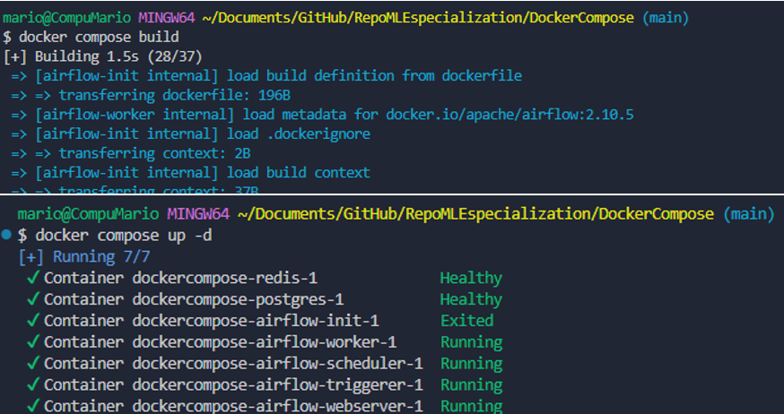
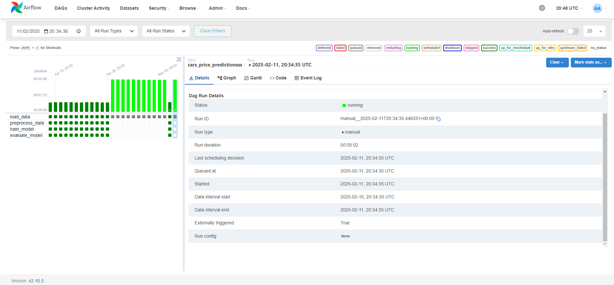
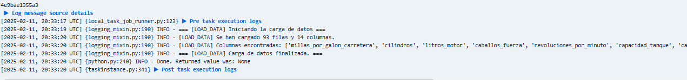
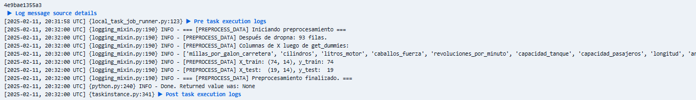
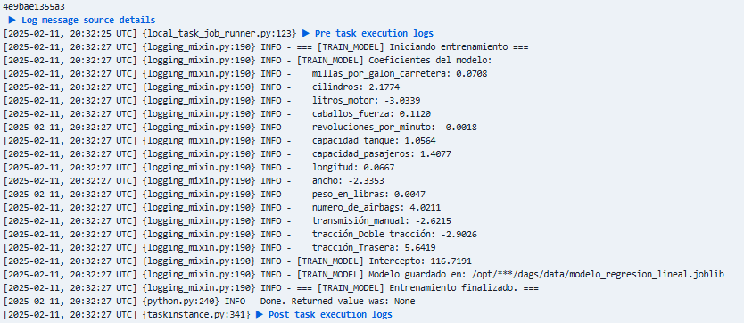
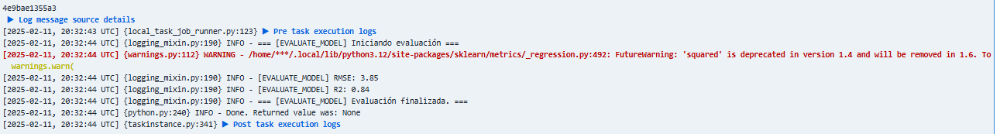

**Documentación de la Solución (CRISP-DM + Airflow + Docker)**

Este proyecto implementa un flujo de trabajo (_pipeline_) para **pronosticar el precio de los vehículos** mediante **regresión lineal múltiple**, siguiendo los lineamientos de **CRISP-DM** (Cross-Industry Standard Process for Data Mining). Se aprovecha **Airflow** para la automatización/orquestación y **Docker** para garantizar que todas las dependencias (librerías como `pandas`, `joblib`, `sklearn`, etc.) estén disponibles.

---

## 1. Estructura CRISP-DM

1. **Business Understanding**

   - El objetivo es **predecir** o **estimar** el precio de vehículos (variable `precio_promedio`), basándose en un conjunto de datos que contiene variables de motor, chasis y otras características (por ejemplo, `litros_motor`, `millas_por_galon_carretera`, `cilindros`, etc.).

2. **Data Understanding**

   - Se trabaja con la data en un archivo Excel `FabricaAutomoviles.xlsx`.
   - Las columnas incluyen variables como `cilindros`, `caballos_fuerza`, `peso_en_libras`, `tracción`, etc.

3. **Data Preparation**

   - Se **limpian** datos nulos con `df.dropna()`.
   - Se **separan** las columnas en `X` (características) y `y` (precio).
   - Algunas columnas categóricas, como `tracción`, se convierten a **dummies** (variables ficticias) para poder usar en la regresión lineal.

4. **Modeling**

   - Se usa `LinearRegression()` de `sklearn`.
   - Se entrena el modelo con los datos `X_train` y `y_train` (80% para entrenamiento y 20% para prueba).

5. **Evaluation**

   - Se calculan métricas como **RMSE** y **R2** para medir la precisión del modelo.
   - Se imprime `RMSE` (error cuadrático medio) y `R2` (qué tan cerca están las predicciones de la recta de regresión perfecta).

6. **Deployment**
   - El modelo final se **serializa** y **guarda** en un archivo Joblib (`modelo_regresion_lineal.joblib`) dentro de la ruta `/opt/airflow/dags/data`.
   - Para futuras predicciones, solo se requiere cargar ese archivo.

---

## 2. Descripción de la Solución Técnica

### a) Docker Compose

- Se usa un `docker-compose.yaml` basado en la configuración oficial de Airflow con CeleryExecutor, Redis y Postgres.
- **Importante**: para instalar las librerías requeridas (p. ej., `openpyxl`), se comenta la línea `image: ...` y se habilita `build: .`, junto con un `Dockerfile` que instala las dependencias (`requirements.txt`).

### b) Airflow

Se creó un **DAG** (Directed Acyclic Graph) llamado `car_price_prediction`, con cuatro tareas principales:

1. **load_data**

   - Toma el archivo Excel (`FabricaAutomoviles.xlsx`) y lo pasa como dict vía XCom.

2. **preprocess_data**

   - Recibe el DataFrame, **elimina nulos** y aplica **get_dummies** en `tracción`.
   - Separa datos en entrenamiento y prueba (80-20).
   - Devuelve los _splits_ (`X_train`, `y_train`, etc.) a XCom.

3. **train_model**

   - Recupera los splits.
   - **Entrena** la regresión lineal múltiple.
   - **Guarda** el modelo con `joblib.dump`.

4. **evaluate_model**
   - Carga el modelo guardado.
   - Predice en el set de prueba.
   - Imprime `RMSE` y `R2`.

Cada tarea está representada con un **`PythonOperator`** en el DAG, y su orden de ejecución es:

```
load_data -> preprocess_data -> train_model -> evaluate_model
```

### c) Código del DAG

```
DockerCompose/dags/pipeline.py
```

### d) Ejecución

1. Ejecutar `docker compose build` y `docker compose up -d`.
2. Entrar a `http://localhost:8080` y acceder a la interfaz de Airflow.
3. Localizar el DAG `car_price_prediction` y activarlo (toggle ON).
4. Ejecutarlo manualmente o esperar el intervalo.
5. Revisar los **logs** de cada tarea para ver cuántos datos se cargaron, cuántos nulos se eliminaron, coeficientes, métricas, etc.

---

## 3. Cómo se Validó que Funcione

- Luego de `preprocess_data`, se imprime cuántos datos hay en `X_train` y `X_test`.
- Al entrenar, se muestra cada coeficiente y el intercepto.
- Finalmente, en la tarea de **evaluate_model**, se imprimen:
  - **RMSE**: Mientras más bajo, mejor.
  - **R2**: Mientras más cercano a 1.0, mejor.
- El modelo se considera razonable si `R2` es aceptable (p. ej. superior a 0.7, como una referencia).

---

## 4. Conclusiones

- Se siguieron las fases de **CRISP-DM**:
  - **Business Understanding**: Predecir precio de automóviles.
  - **Data Understanding**: Inspección inicial de datos en Excel.
  - **Data Preparation**: Limpieza de nulos y codificación de columnas categóricas.
  - **Modeling**: Se usó `LinearRegression` con `scikit-learn`.
  - **Evaluation**: Métricas (`RMSE`, `R2`).
  - **Deployment**: Pipeline automatizado en Airflow, guardando modelo en `.joblib`.
- Con **Docker** se garantizó el entorno reproducible.
- Con **Airflow**, se orquestan las tareas, se programan y monitorean de forma centralizada.

Este enfoque **modular**, con tareas separadas, permite escalar y/o modificar el proceso (por ejemplo, incorporar limpieza adicional o diferentes algoritmos). Además, es fácil **programar** la ejecución diaria y mantener registro de los logs y la evolución de la métrica de predicción.

## 5. Pruebas







